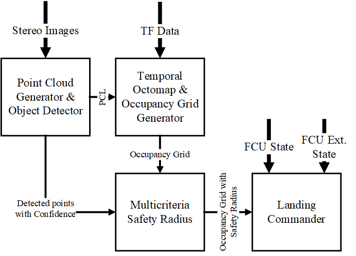

# UAV Landing Safety Pipeline
A Lightweight Pipeline for landing obstacles avoidance and safe landing zone extraction

In this repository you can find our proposed pipeline for safe landing areas. It is implemented in ROS.

The pipeline is consisted of four submodules:

<ul>
  <li>Point Cloud Generator</li>
  <li>Temporal Octomap</li>
  <li>Multicriteria Safety Distance</li>
  <li>Landing Commander</li>
</ul>

## __Point Cloud Generator__
The backbone of this submodule is the object detector. In that case we use the YOLO v7. A pair of stereo images is collected and then feeded to the object detector. The centers of the detections' bounding boxes are matched and then triangulated to produce a point cloud (ROS pointcloud2 msg) consisting only of the network's detections.

### Subscribing Topics
<ul>
  <li><code>/stereo/left/image_raw</code></li>
  <li><code>/stereo/left/camera_info</code></li>
  <li><code>/stereo/right/image_raw</code></li>
  <li><code>/stereo/left/camera_info</code></li>
</ul>

### Publishing Topics
<ul>
  <li><code>/PointCloud</code></li>
  <li><code>/yolo_pointcloud/detected_objects</code></li>
  <li><code>/yolo_pointcloud/detection_image</code></li>
  <li><code>/yolo_pointcloud/point_with_confidence</code></li>
  <li><code>/yolo_pointcloud_stereo_debug</code></li>
</ul>

### Parameters
<ul>
  <li><code>~weigths</code></li>
  Path to the network's weights.
  <li><code>~matching_distance_coefficient</code></li>
  Distance coefficient of two points, in image pairs, to match them.
  <li><code>~confidence</code></li>
  Confidence threshold. Detections with conf. less than this value are ignored.
  <li><code>~max_detections</code></li>
  Maximum number of detections in each frame.
  <li><code>~device</code></li>
  Device that the network in loaded on.
  <li><code>~camera0_topic</code></li>
  <li><code>~camera0_info_topic</code></li>
  <li><code>~camera1_topic</code></li>
  <li><code>~camera1_info_topic</code></li>
</ul>

## __Temporal Octomap__
This submodule has as its input the <code>pointcloud2</code> msg from the Point Cloud Generator. The point cloud is inserted into an Octomap for its efficient manipulation. This module is very similar to [octomap_mapping](https://github.com/OctoMap/octomap_mapping.git) package. One key difference is the deletion of every octree node after a predefined time frame. The outoput of this module comprises of an occupancy grid projected on the ground plane that represents occupied space by landing obstacles.

### Subscribing Topics
<ul>
  <li><code>/PointCloud</code></li>
</ul>

### Publishing Topics
<ul>
  <li><code>/occupied_cells_vis_array</code></li>
  <li><code>/projected_map</code></li>
  <li><code>/temporal_octomap_debug</code></li>
</ul>

### Parameters
<ul>
  <li><code>~frame_id</code></li>
  <li><code>~min_x_size</code></li>
  <li><code>~min_y_size</code></li>
  <li><code>~max_range</code></li>
  <li><code>~resolution</code></li>
  <li><code>~sensor_model/hit</code></li>
  <li><code>~sensor_model/miss</code></li>
  <li><code>~sensor_model/min</code></li>
  <li><code>~sensor_model/max</code></li>
  <li><code>~Occupancy_Thres</code></li>
  <li><code>~sensor_model/min</code></li>
  <li><code>~decaytime/sec</code></li>
  <li><code>~decaytime/nsec</code></li>
</ul>

## __Multicriteria Safety Distance__
This modules recieves 2 messages as input. The Detections' Points along with their confidence as well as the occupancy grid produced by the Temporal Octomap Module. Collecting various data for each cell of the occupancy grid (i.e detections sum, average confidence, average gradient, and detections' density), it uses a weighted sum model to determine the safety radius for each occupied cell in the occupancy grid.

### Subscribing Topics
<ul>
  <li><code>/yolo_pointcloud/point_with_confidence</code></li>
  <li><code>/projected_map</code></li>
</ul>

### Publishing Topics
<ul>
  <li><code>/projected_map_with_safety_dist</code></li>
</ul>

### Parameters
<ul>
  <li><code>~res</code></li>
  Resolution of the occupancy grid (ressolution of the whole pipeline)
  <li><code>~min_safety_radius</code></li>
  Minimum safety radius.
  <li><code>~max_safety_radius</code></li>
  Maximum safety radius.
  <li><code>~multisample_resolution</code></li>
  Resolution for calculating the density and gradient of detections (<code>~res</code> x <code>~res</code>).
  <li><code>~detections_weight</code></li>
  Weight for the sum of detections
  <li><code>~average_slope_weight</code></li>
  Weight for the gradient of detections.
  <li><code>~average_density</code></li>
  Weight for the density of the detections.
</ul>

## __Landing Commander__
This is the last module of the pipeline and it handles the safe landing points extraction and the landing procedure itself. The latter is base on the PX4 Autopilot software.

### Subscribing Topics
<ul>
  <li><code>/projected_map</code></li>
  <li><code>/mavros/state</code></li>
  <li><code>/mavros/extended_state</code></li>
</ul>

### Publishing Topics
<ul>
  <li><code>/occupancy_output</code></li>
  <li><code>/landing_commander_debug</code></li>
  <li><code>/debug_landing_targets</code></li>
  <li><code>/mavros/setpoint_position/local</code></li>
</ul>

### Parameters
<ul>
  <li><code>~safety_dist</code></li>
  Safety radius drawn from each occupied cell in the occupancy grid
  <li><code>~target_proc_time</code></li>
  The processing time target for the dynamic stride
  <li><code>~safety_area</code></li>
  Land point searching begins after x meters.
  <li><code>~minimum_stirde</code></li>
  The minimum searching stride
  <li><code>~stride_coef</code></li>
  Coef for stride change intensity
  <li><code>~robot_frame/hit</code></li>
  The UAV's frame name
  <li><code>~land_to_base</code></li>
  Taget is to land to the base 
  <li><code>~debug</code></li>
  Publish debug msgs
  <li><code>~show_occupancy_map</code></li>
  Display occupancy map  
</ul>

## __Other__

### A tool to help evaluate the performance of this pipeline can be found in [gazebo_occupancy](https://github.com/telemc97/gazebo_occupancy.git) repo

### Experiments done to evaluate the performance of this pipeline can be found in [safety_pipeline_experiments](https://github.com/telemc97/safety_pipeline_experiments.git) repo

